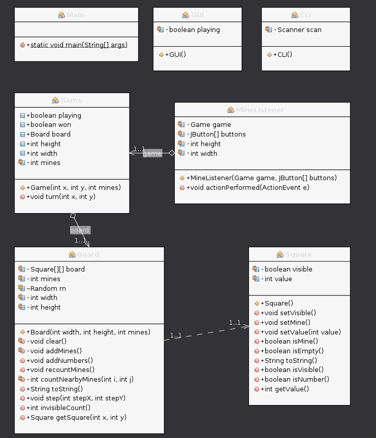

# Project description and plan

> Minesweeper is a single-player puzzle video game. The objective of the game is to clear a rectangular board containing hidden "mines" without detonating any of them, with help from clues about the number of neighboring mines in each field.
>
> *[Wikipedia: Minesweeper (video game)](https://en.wikipedia.org/wiki/Minesweeper_(video_game))*

Initial goals include:

- [ ] GUI with user-clickable button grid, game area
- [ ] Minesweeper level generation logic:
  - [ ] Decide an amount of squares to have mines under them
  - [ ] For all squares, count number of surrounding mines with radius 1 (8 surrounding squares), and set that as the square info
  - [ ] For all squares with no surrounding mines, set square info to be empty
- [ ] Minesweeper game logic:
  - [ ] If user clicks on a square with a mine, game over
  - [ ] If user clicks on a square with safe area, reveal all connected safe areas + margin of 1 number blocks
  - [ ] If user clicks on a square with a number, reveal that number
- [ ] Randomization of levels with editable parameters
- [ ] Complete, playable minesweeper experience

Optional bonus goals:

- [ ] Level editor
- [ ] Odd variants
  - [ ] Wraparound from edges?
  - [ ] Non-square grid?

**Preliminary UML diagram**

